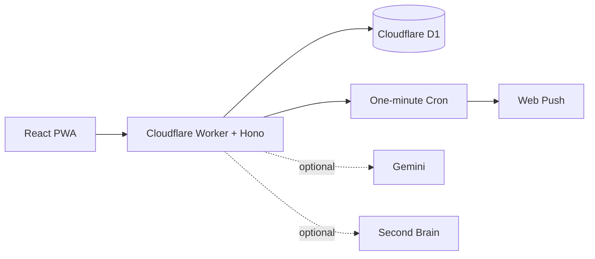

# Nudge

> **Your private AI assistant for tasks, memory, and follow-ups.**

Nudge is a self-hosted personal assistant for capturing work, remembering what matters, and following up at the right time. It is a polished React PWA backed by one Cloudflare Worker, with D1 for operational data and optional AI services for voice and memory.

[](https://github.com/junioralive/nudge/actions/workflows/ci.yml)
[](LICENSE)
[](https://deploy.workers.cloudflare.com/?url=https://github.com/junioralive/nudge)

## Why Nudge

Most task apps help you record work. Nudge helps you keep momentum.

- Capture tasks by typing or voice.
- Keep full context, deadlines, workspaces, and follow-ups together.
- Receive privacy-safe reminders on every enabled device.
- Review completed work without mixing it into your active agenda.
- Add Gemini voice assistance and Second Brain recall only when you want them.

Nudge is useful without either integration. Core tasks, authentication, D1 storage, PWA install, and push reminders remain fully independent.

## Product preview


The interface keeps the active agenda quiet, makes workspaces easy to scan, and keeps completed history one click away.

## What it looks like

Nudge is designed as a focused, single-user workspace:

| Area | Purpose |
| --- | --- |
| Today | See what needs attention now. |
| All tasks | Search and manage open work across workspaces. |
| Completed | Keep a durable history of finished work. |
| Memories | Optional semantic recall from Second Brain. |
| Voice | Optional Gemini assistant for hands-free capture and recall. |

## Architecture



### Data ownership

- **Nudge D1** stores tasks, details, workspaces, profile settings, reminders, delivery state, and push subscriptions.
- **Second Brain** stores durable memories only when the optional integration is enabled and a memory action is explicit or approved by the assistant.
- **Gemini** handles optional voice sessions and spoken task capture. Nudge uses the configured live model only; reminders use the saved task text and do not make extra Gemini calls.
- Raw audio, transcripts, assistant output, credentials, tokens, and private keys are not saved as memories.

## Deploy on Cloudflare

### Fastest path

[](https://deploy.workers.cloudflare.com/?url=https://github.com/junioralive/nudge)

The button clones the repository, provisions both D1 databases, Vectorize, Workers AI, and Durable Objects, then runs Nudge's build, secret generation, migrations, and deployment scripts. Cloudflare shows two KV fields but cannot derive separate default names for them. For a new `nudge` installation, name the first KV `nudge-email` and the second `nudge-memories-config`. Resource IDs from the template are validated against the target account and safely replaced with resources using the selected Worker name.

For the easiest installation, enter a private `NUDGE_AUTH_KEY` of at least 15 characters in the encrypted Deploy field. Nudge then works without Zero Trust. If neither a valid key nor complete Access configuration exists, the Worker fails closed.

To choose authentication interactively, run the guided setup from the generated repository:

```sh
npm install
npx wrangler login
npm run setup:cloudflare
```

The wizard offers **Nudge Key** or **Cloudflare Zero Trust**. Key mode asks only for the private key. Access mode asks for the owner email and a temporary, narrowly scoped Access token, then configures email OTP and Managed OAuth. The token remains memory-only.

You can also skip the button and run the same guided setup directly after cloning:

```sh
npm install
npx wrangler login
npm run setup:cloudflare
```

The setup wizard asks for an authentication choice. Nudge Key requires a 15+ character private key; Zero Trust requires an owner email and temporary Cloudflare API token with Access application/policy write permission. Optional flags are `--domain`, `--worker-name`, and `--redirect-uri`.

It then creates or reuses the `nudge-*` resources, generates VAPID/encryption/action secrets, applies migrations, and deploys. Access resources are created only when Zero Trust is selected. First-login onboarding collects your profile. Gemini and Microsoft Outlook are optional Settings integrations.

If you skip a custom domain, Cloudflare keeps the `workers.dev` URL available.

#### Cloudflare Workers Builds

The **Connect repository to Worker** flow is different from the Deploy button: it does not show D1, KV, or Vectorize selectors. Nudge's deploy script provisions or reuses those resources during the build instead.

For a Git-connected deployment or a fork, keep the repository root as `/` and replace Cloudflare's default `npx wrangler deploy` command with:

```text
Build command:  (leave blank)
Deploy command: npm run deploy
```

Do not accept `npx wrangler deploy` for Nudge. It bypasses Nudge's generated-secret checks and migration runner. `npm run deploy` performs the Vite build itself, provisions or reuses both KV namespaces and databases, generates missing encryption/action/VAPID secrets, deploys the Worker, and applies both task and Memories migrations.

The repository includes an account-safe root `wrangler.jsonc` so Cloudflare can detect the project without workspace auto-detection. The Deploy-button form shows two distinct KV bindings: use `nudge-email` for the first (`EMAIL_KV`) and `nudge-memories-config` for the second (`MEMORY_CONFIG_KV`).

Cloudflare treats values sourced from `.dev.vars.example` as encrypted Worker-secret inputs. Nudge exposes only the optional `NUDGE_AUTH_KEY` there; encryption, action-signing, and VAPID secrets are generated during deployment. Local-only examples remain under `web/.dev.vars.example`.

## Local development

Requirements: Node.js 22+, npm, and a Cloudflare account for deployment.

```sh
npm install
npm run dev
```

For local secrets, copy `web/.dev.vars.example` to `web/.dev.vars` and use development-only values. Never commit that file.

## Configuration

Authentication configuration:

- `AUTH_MODE=auto|key|access` — `auto` safely prefers complete Access configuration, then falls back to Key
- `NUDGE_AUTH_KEY` — required only for Key mode; encrypted and at least 15 characters
- `TEAM_DOMAIN`, `NUDGE_ACCESS_AUD`, and `NUDGE_OWNER_EMAIL` — required only for Access mode

Required Worker configuration:

- `VAPID_PUBLIC_KEY` and `VAPID_PRIVATE_KEY` — generated automatically for Web Push delivery
- `NUDGE_ENCRYPTION_KEY` — generated for new Email KV and integration stores; existing deployments temporarily accept `CREDENTIAL_ENCRYPTION_KEY`
- `NUDGE_ACTION_SIGNING_SECRET` — generated for one-time browser email approvals

Optional secrets:

- `GEMINI_API_KEY` — enables the voice assistant

The first-login onboarding stores display name, timezone, assistant gender, and voice in D1. No separate session secret or MCP audience is required.

## Optional integrations

Nudge is deliberately useful without external AI. Add these integrations only when you want their specific capabilities.

### Gemini — voice and assistant intelligence

[Google AI Studio](https://ai.google.dev/aistudio) is where you create and manage a Gemini API key. Gemini powers Nudge's optional live voice assistant, structured task capture, and memory-tool decisions. It does not own your task database, and the key stays server-side in Cloudflare. Reminders do not call Gemini separately.

Setup:

1. Open [Google AI Studio](https://aistudio.google.com/).
2. Create an API key from the [Gemini API key page](https://aistudio.google.com/app/apikey).
3. Enable Gemini in `npm run setup:cloudflare`, or add the secret manually:

   ```sh
   npx wrangler secret put GEMINI_API_KEY
   ```

Without Gemini, Nudge keeps task management and standard reminders working and hides voice controls.

### Memories — durable memory and semantic recall

Memories is embedded in Nudge and based on the core engine from [Second Brain Cloudflare](https://github.com/rahilp/second-brain-cloudflare). It uses the separately bound `nudge-memories` D1 database, `nudge-memories-config` KV namespace, and `nudge-memories-vectors` index. No external Second Brain URL or token is required.

### Email — inbox and MCP

Email is embedded in the Nudge Worker. It uses the encrypted `EMAIL_KV` mailbox store and supports Outlook OAuth plus custom IMAP/SMTP accounts. Nudge never stores mailbox credentials or message bodies in D1, the browser, Gemini context outside an explicit request, or Second Brain.

The permanent MCP endpoint is:

```text
https://<your-nudge-host>/email/mcp
```

In Access mode, Managed OAuth provides 15-minute tokens and 24-hour grants. In Key mode, Nudge exposes its own PKCE OAuth flow with the same lifetimes; the authorization page verifies the Nudge key without sharing it with ChatGPT or Claude. Email and Memories connectors receive isolated scopes.

For an existing Access application configured manually, add these **Managed OAuth → Allowed redirect URIs** before connecting an MCP client:

```text
https://chatgpt.com/*
https://claude.ai/*
```

```text
https://<your-nudge-host>/api/email/oauth/outlook/callback
```

Keep the old standalone Email MCP Worker online during migration. Reconnect MCP clients to the new endpoint only after inbox and reviewed-send acceptance tests pass.

## Security model

Nudge is intentionally single-user and private by default.

- All data APIs require authentication.
- Browser mutations require same-origin requests.
- Access mode validates the Cloudflare issuer, audience, expiry, and owner email on every request.
- Key mode uses constant-time key verification, a signed 30-day HttpOnly cookie, login throttling, and scoped PKCE OAuth for MCP clients.
- In `auto`, complete Access configuration always wins, so adding a Nudge key cannot bypass an existing Access installation.
- MCP access tokens last 15 minutes and refresh grants last 24 hours.
- Voice endpoints are rate-limited.
- Service-worker caches contain application assets only, never authenticated API responses.
- Secrets stay in Cloudflare Worker secrets and are never sent to frontend code.

Read the [security guide](docs/SECURITY.md) before exposing an installation publicly. Enable GitHub secret scanning, push protection, Dependabot, and code scanning for public forks.

## Commands

```sh
npm run setup:cloudflare  # guided first deployment
npm run dev               # local development
npm test                  # focused Worker tests
npm run typecheck         # Wrangler types + TypeScript
npm run build             # production PWA/Worker build
npm run deploy            # deploy configured Worker
npm run migrate:sqlite    # optional legacy SQLite import
```

## Documentation

- [Self-hosting](docs/SELF_HOSTING.md)
- [Architecture and data ownership](docs/ARCHITECTURE.md)
- [REST API](docs/API.md)
- [Push and PWA setup](docs/PUSH.md)
- [Security and responsible disclosure](docs/SECURITY.md)
- [Troubleshooting](docs/TROUBLESHOOTING.md)

## Contributing

Small, focused pull requests are welcome. Before opening one, run:

```sh
npm test
npm run typecheck
npm run build
npm audit --omit=dev
```

Please do not include local databases, `.dev.vars`, API keys, login-key exports, or personal deployment configuration in commits.

## License

MIT © Nudge contributors
