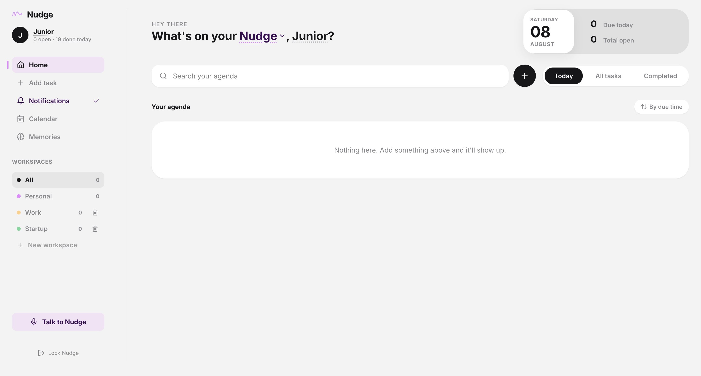
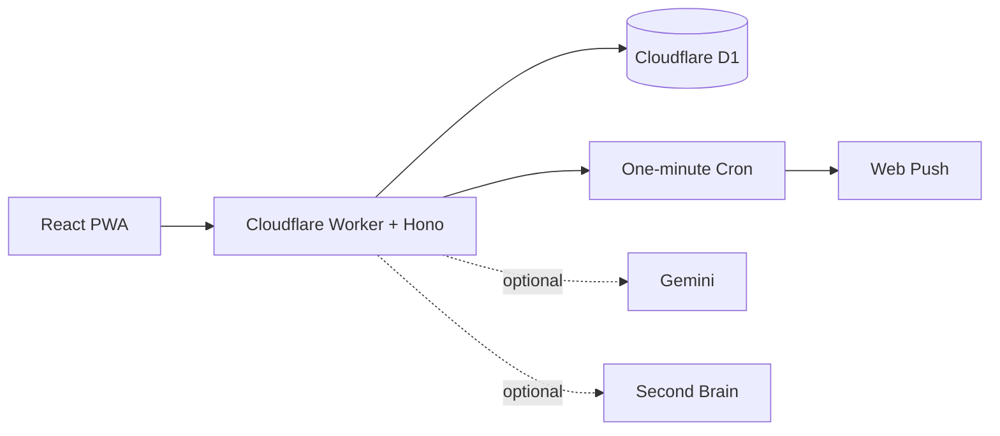

# Nudge

> **Your private AI assistant for tasks, memory, and follow-ups.**

Nudge is a self-hosted personal assistant for capturing work, remembering what matters, and following up at the right time. It is a polished React PWA backed by one Cloudflare Worker, with D1 for operational data and optional AI services for voice and memory.

[](https://github.com/junioralive/nudge/actions/workflows/ci.yml)
[](LICENSE)
[](https://deploy.workers.cloudflare.com/?url=https://github.com/junioralive/nudge)

## Why Nudge

Most task apps help you record work. Nudge helps you keep momentum.

- Capture tasks by typing or voice.
- Keep full context, deadlines, workspaces, and follow-ups together.
- Receive privacy-safe reminders on every enabled device.
- Review completed work without mixing it into your active agenda.
- Add Gemini voice assistance and Second Brain recall only when you want them.

Nudge is useful without either integration. Core tasks, authentication, D1 storage, PWA install, and push reminders remain fully independent.

## Product preview



The interface keeps the active agenda quiet, makes workspaces easy to scan, and keeps completed history one click away.

## What it looks like

Nudge is designed as a focused, single-user workspace:

| Area | Purpose |
| --- | --- |
| Today | See what needs attention now. |
| All tasks | Search and manage open work across workspaces. |
| Completed | Keep a durable history of finished work. |
| Memories | Optional semantic recall from Second Brain. |
| Voice | Optional Gemini assistant for hands-free capture and recall. |

## Architecture



### Data ownership

- **Nudge D1** stores tasks, details, workspaces, profile settings, reminders, delivery state, and push subscriptions.
- **Second Brain** stores durable memories only when the optional integration is enabled and a memory action is explicit or approved by the assistant.
- **Gemini** handles optional voice sessions and reminder wording. Gemini is never required for normal task operations.
- Raw audio, transcripts, assistant output, credentials, tokens, and private keys are not saved as memories.

## Deploy on Cloudflare

### Fastest path

[](https://deploy.workers.cloudflare.com/?url=https://github.com/junioralive/nudge)

Cloudflare clones the repository and provisions the Worker project. Then run the guided setup from the new checkout to finish D1, secrets, profile, and optional integrations:

```sh
npm install
npx wrangler login
npm run setup:cloudflare
```

The setup wizard asks for:

- Worker name and optional custom domain
- Your name, timezone, assistant pronouns, and initial workspaces
- Whether Gemini should be enabled
- Whether Second Brain should be enabled and its URL

It then creates or reuses D1, generates session and VAPID secrets, applies migrations, seeds your profile, and deploys. Gemini and Second Brain are **off by default**. No personal URL, token, or API key is included in this repository.

If you skip a custom domain, Cloudflare keeps the `workers.dev` URL available.

#### Cloudflare Workers Builds

For a Git-connected deployment, keep the repository root as `/` and set these two commands in **Settings → Builds → Build configurations**:

```text
Build command:  npm run cloudflare:build
Deploy command: npm run cloudflare:deploy
```

The repository includes a root `wrangler.jsonc` so Cloudflare can detect the project without workspace auto-detection. The guided setup writes your real D1 binding and deployment values into `web/wrangler.jsonc`; keep the build and deploy commands above so Vite generates the final Worker bundle and asset manifest before deployment.

## Local development

Requirements: Node.js 22+, npm, and a Cloudflare account for deployment.

```sh
npm install
npm run dev
```

For local secrets, copy `web/.dev.vars.example` to `web/.dev.vars` and use development-only values. Never commit that file.

## Configuration

Required Worker secrets:

- `NUDGE_AUTH_KEY` — the single-user login key
- `SESSION_SECRET` — signs authenticated sessions
- `VAPID_PUBLIC_KEY` and `VAPID_PRIVATE_KEY` — Web Push delivery

Optional secrets:

- `GEMINI_API_KEY` — enables voice and AI reminder wording
- `SECOND_BRAIN_TOKEN` — enables memory capture and recall

Configuration variables include `APP_TIMEZONE`, `VAPID_SUBJECT`, `NUDGE_ASSISTANT_GENDER`, `GEMINI_LIVE_MODEL`, `GEMINI_REMINDER_MODEL`, and optional `SECOND_BRAIN_URL`.

## Optional integrations

Nudge is deliberately useful without external AI. Add these integrations only when you want their specific capabilities.

### Gemini — voice and assistant intelligence

[Google AI Studio](https://ai.google.dev/aistudio) is where you create and manage a Gemini API key. Gemini powers Nudge's optional voice assistant, structured task capture, memory-tool decisions, and concise reminder wording. It does not own your task database, and the key stays server-side in Cloudflare.

Setup:

1. Open [Google AI Studio](https://aistudio.google.com/).
2. Create an API key from the [Gemini API key page](https://aistudio.google.com/app/apikey).
3. Enable Gemini in `npm run setup:cloudflare`, or add the secret manually:

   ```sh
   npx wrangler secret put GEMINI_API_KEY
   ```

Without Gemini, Nudge keeps task management and standard reminders working and hides voice controls.

### Second Brain — durable memory and semantic recall

[Second Brain Cloudflare](https://github.com/rahilp/second-brain-cloudflare) is an optional, separate memory layer. It is useful for durable preferences, decisions, people, and project context that should be recalled across conversations. Nudge remains the source of truth for exact task state; Second Brain is never required for tasks or reminders.

Setup:

1. Deploy your own Second Brain instance from its repository.
2. Copy its base URL and API token.
3. Enable Second Brain in `npm run setup:cloudflare`, or configure `SECOND_BRAIN_URL` and the `SECOND_BRAIN_TOKEN` secret manually.

Without Second Brain, Nudge hides Memories and skips recall without delaying task operations. Nudge never sends the token to the browser.

You can enable either integration independently, or use both together.

## Security model

Nudge is intentionally single-user and private by default.

- All data APIs require authentication.
- Browser mutations require same-origin requests.
- Sessions use `HttpOnly`, `Secure`, `SameSite=Strict` cookies.
- Login and voice endpoints are rate-limited.
- Service-worker caches contain application assets only, never authenticated API responses.
- Secrets stay in Cloudflare Worker secrets and are never sent to frontend code.

Read the [security guide](docs/SECURITY.md) before exposing an installation publicly. Enable GitHub secret scanning, push protection, Dependabot, and code scanning for public forks.

## Commands

```sh
npm run setup:cloudflare  # guided first deployment
npm run dev               # local development
npm test                  # focused Worker tests
npm run typecheck         # Wrangler types + TypeScript
npm run build             # production PWA/Worker build
npm run deploy            # deploy configured Worker
npm run migrate:sqlite    # optional legacy SQLite import
```

## Documentation

- [Self-hosting](docs/SELF_HOSTING.md)
- [Architecture and data ownership](docs/ARCHITECTURE.md)
- [REST API](docs/API.md)
- [Push and PWA setup](docs/PUSH.md)
- [Security and responsible disclosure](docs/SECURITY.md)
- [Troubleshooting](docs/TROUBLESHOOTING.md)

## Contributing

Small, focused pull requests are welcome. Before opening one, run:

```sh
npm test
npm run typecheck
npm run build
npm audit --omit=dev
```

Please do not include local databases, `.dev.vars`, API keys, login-key exports, or personal deployment configuration in commits.

## License

MIT © Nudge contributors
